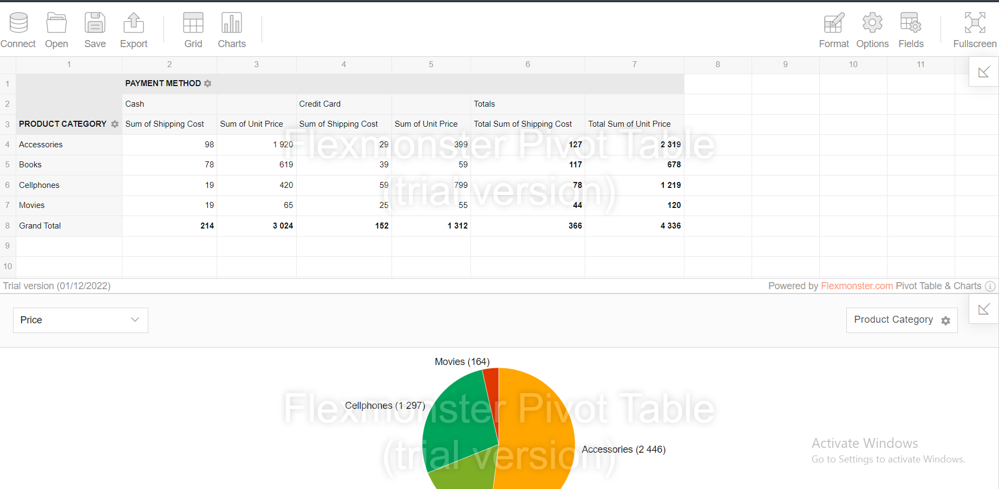

# Analytic with Django

## How to run the project
To run the Django development server, execute the following command:

`python manage.py runserver`

Next, open the following URL in your browser:

`http://127.0.0.1:8000/dashboard/`

## License

[veronikaro](https://github.com/veronikaro)